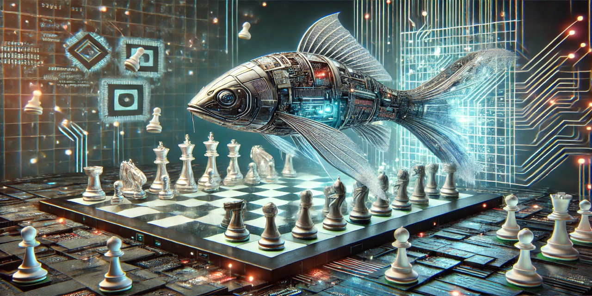

# Overview

This is an attempt to make a Java port of the well known chess engine Stockfish.
It uses the Stockfish NNUE via JNI and all other Java code is based on the chess engine Bagatur.
It pretends to be the strongest Java chess engine in the world. Let's see ...

If you like the project, please give it a star! :-)

# UCI Options

